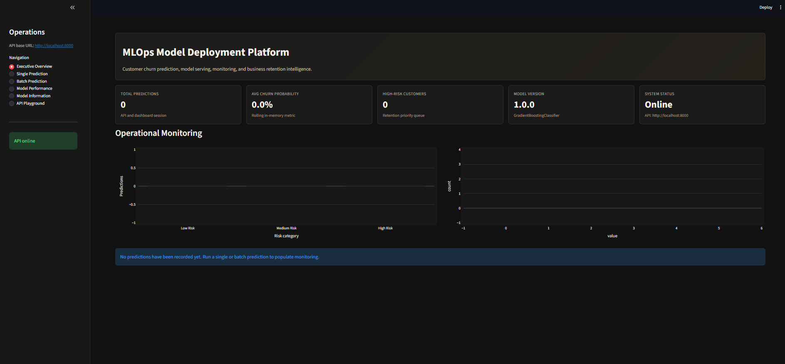
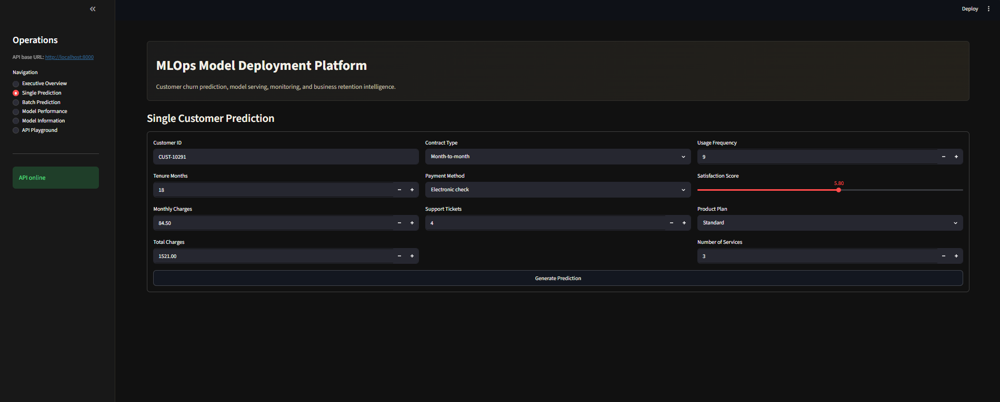
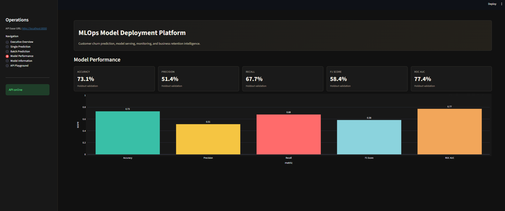
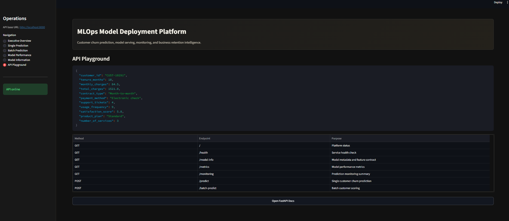

# MLOps Model Deployment Platform

Live demo: _Add Render/Railway and Streamlit URLs here after deployment._

## Project Overview

This is a production-style customer churn prediction platform that demonstrates the full lifecycle of a machine learning deployment: model training, artifact versioning, API serving, dashboard operations, monitoring simulation, testing, Dockerization, and deployment documentation.

The project is designed to look and behave like an internal AI platform a business team could use to identify customers at risk of churn and prioritize retention actions.

## Business Problem

Customer churn directly affects recurring revenue, support planning, and customer success strategy. The platform predicts churn probability from customer profile and engagement data, then translates the model output into risk levels and retention recommendations.

Prediction output includes:

- Churn probability
- Predicted churn class
- Risk level: Low Risk, Medium Risk, or High Risk
- Business recommendation
- Suggested retention action
- Model version and timestamp

## Solution Architecture

```text
Synthetic Customer Data
        |
        v
Training Pipeline -> model.pkl + metrics.json + model_info.json
        |
        v
FastAPI Model Serving API
        |
        +--> Single prediction endpoint
        +--> Batch prediction endpoint
        +--> Model metadata endpoint
        +--> Metrics endpoint
        +--> Monitoring summary endpoint
        |
        v
Streamlit Operations Dashboard
```

## Features

- Synthetic customer churn dataset generation
- Scikit-learn preprocessing and Gradient Boosting model pipeline
- Versioned model artifact saved with Joblib
- Metrics artifact with accuracy, precision, recall, F1, and ROC AUC
- Model metadata artifact with feature contract and training details
- Holdout-optimized decision threshold stored with model metadata
- FastAPI backend with validation, error handling, logging, and OpenAPI docs
- Single and batch prediction endpoints
- In-memory request monitoring summary
- Streamlit dashboard with executive overview, prediction tools, batch scoring, charts, model details, and API playground
- Dockerfile and Docker Compose for API plus dashboard
- Pytest suite for API and prediction logic
- Deployment notes for local, Docker, Render, Railway, and Streamlit

## Tech Stack

- Python
- FastAPI
- Streamlit
- Scikit-learn
- Pandas
- NumPy
- Plotly
- Joblib
- Pydantic
- Uvicorn
- Docker
- Pytest

## Folder Structure

```text
mlops-model-deployment-platform/
  app/
    main.py
    schemas.py
    prediction.py
    config.py
    logger.py
  dashboard/
    streamlit_app.py
  model/
    train_model.py
    model.pkl
    metrics.json
    model_info.json
  data/
    sample_customers.csv
  tests/
    test_api.py
    test_prediction.py
    test_training_artifacts.py
  notebooks/
    model_exploration.ipynb
  docs/
    architecture.md
    api_documentation.md
    deployment_guide.md
  .github/
    workflows/
      ci.yml
  Dockerfile
  docker-compose.yml
  pyproject.toml
  requirements.txt
  README.md
  .env.example
  .gitignore
  LICENSE
```

## Run Locally

Create and activate a virtual environment:

```bash
python -m venv .venv
.venv\Scripts\activate
```

Install dependencies:

```bash
pip install -r requirements.txt
```

Train the model:

```bash
python model/train_model.py
```

Run the FastAPI backend:

```bash
uvicorn app.main:app --reload
```

Open API docs:

```text
http://localhost:8000/docs
```

Run the Streamlit dashboard in a second terminal:

```bash
streamlit run dashboard/streamlit_app.py
```

Open the dashboard:

```text
http://localhost:8501
```

## Docker

Build and start both services:

```bash
docker-compose up --build
```

Services:

- FastAPI: `http://localhost:8000`
- Streamlit: `http://localhost:8501`

The Compose file includes health checks for both services and waits for the API to become healthy before starting the dashboard.

## API Endpoints

| Method | Endpoint | Description |
| --- | --- | --- |
| GET | `/` | Platform status |
| GET | `/health` | Service health |
| GET | `/model-info` | Model metadata and feature contract |
| GET | `/metrics` | Model performance metrics |
| GET | `/monitoring` | In-memory prediction monitoring summary |
| POST | `/predict` | Predict churn risk for one customer |
| POST | `/batch-predict` | Predict churn risk for multiple customers |

## Example Request

```json
{
  "customer_id": "CUST-10291",
  "tenure_months": 18,
  "monthly_charges": 84.5,
  "total_charges": 1521.0,
  "contract_type": "Month-to-month",
  "payment_method": "Electronic check",
  "support_tickets": 4,
  "usage_frequency": 9,
  "satisfaction_score": 5.8,
  "product_plan": "Standard",
  "number_of_services": 3
}
```

## Example Response

```json
{
  "customer_id": "CUST-10291",
  "churn_probability": 0.7342,
  "predicted_class": 1,
  "risk_level": "High Risk",
  "recommendation": "Prioritize immediate retention action, account review, and incentive offer.",
  "suggested_retention_action": "Escalate to retention team, review open issues, and prepare a targeted incentive.",
  "model_version": "1.0.0",
  "timestamp": "2026-06-15T22:30:00.000000Z"
}
```

## Testing

Run the automated tests:

```bash
pytest
```

The tests validate health checks, metadata, prediction response structure, invalid input handling, batch prediction, and feature payload behavior.

The repository also includes a GitHub Actions workflow at `.github/workflows/ci.yml` that installs dependencies, trains the model artifacts, and runs the test suite on pull requests and pushes to `main` or `master`.

## Screenshots

### Executive Overview



### Single Prediction



### Model Performance



### API Playground



## Future Improvements

- Add a persistent prediction event store with PostgreSQL
- Add drift detection and data quality reports
- Add CI/CD workflow for tests and Docker image builds
- Add MLflow or a model registry for richer experiment tracking
- Add authentication and role-based access control
- Add canary deployment support for new model versions

## Portfolio Value

This project demonstrates applied MLOps skills beyond notebook modeling:

- Training reproducible ML artifacts
- Serving models through a typed API
- Designing business-friendly prediction responses
- Validating payloads with Pydantic
- Tracking request-level monitoring signals
- Building an operations dashboard
- Containerizing services for deployment
- Writing tests for model serving behavior
- Documenting architecture and deployment workflows

## Author

Ensar Maxhuni
